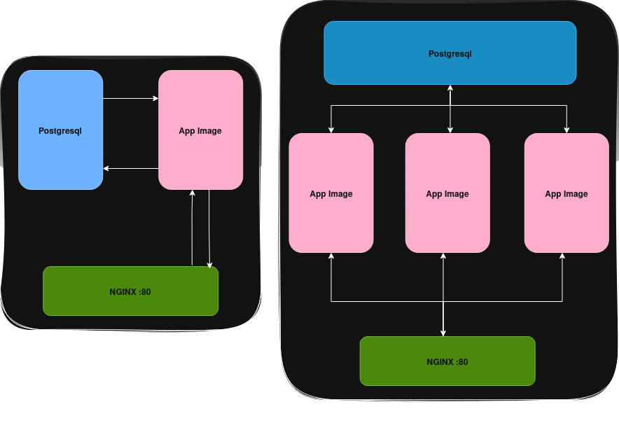

# 📃 Taskey Remote Server


Taskey, proje yönetiminde tekrarlayan işleri hızlandırmayı komutlar sayesinde yapan, local-first yaklaşımlı bir projedir. Taskey remote server amacı ise docker ile çalışan, local ortamı senkronize ederek işbirliği yapabilmeyi sağlayan bir araçtır.

## Quick Start

```bash
git clone https://github.com/muozez/taskey-server.git
cd taskey-server
docker compose up -d
```

Uygulama `http://localhost:80` adresinde ayağa kalkar. İlk açılışta `/setup.html` üzerinden yönetici hesabınızı oluşturun.

---

# Mimari - Uygulamalar arası haberleşme



Taskey Remote Server; **stateless API layer** + **PostgreSQL persistence** + **NGINX reverse proxy** mimarisi ile çalışır. Sync engine, versiyon bazlı reconcile mekanizması kullanarak offline-first client'ları diff tabanlı incremental senkronizasyon ile koordine eder. NGINX, `least_conn` stratejisi ile load balancing yapar ve `docker compose up --scale app=N` ile yatay ölçeklenir.

# Kullanılan Teknolojiler

**HTML/CSS**: Uygulamanın minimum kaynak tüketmesi için saf html/css ile dashboard tasarlandı.

**Javascript**: Uygulamanın mantık tarafı tamamen javascript ile geliştirildi.

**[Node.js](https://nodejs.org/)**: Uygulamanın backend'i tamamen Node.js ile geliştirildi. Javascript ile beraber kullanıldı.

**[PostgreSQL](https://www.postgresql.org/)**: Connection Pooling, ACID güvenirliği için PostgreSQL kullanıldı. İlişkisel veritabanı seçilme sebebi ise changelog tutarken sadece değişimleri minimize ederek satır satır tutmaktır. JSONB veri tipi kullanıldı.

**[Sequelize](https://sequelize.org/)**: ORM olarak Sequelize kullanıldı. Hızlı, basit ve kolay prototipleme için kullanıldı.

**[Docker](https://www.docker.com/)**: Altyapı için Docker kullanıldı. Docker Compose ile orkestre edildi. İstenilirse Kubernetes'e geçirilebilir.

**[NGINX](https://nginx.org/)**: Reverse-proxy ve load balancing için NGINX kullanıldı.

# Offline-First Sync Mimarisi

Taskey, **diff tabanlı incremental senkronizasyon** ve **offline-first** mimariyi destekler. Her lokal client bağımsız çalışır ve çevrimdışı iken bile değişiklik yapabilir. Yeniden bağlandığında biriken diff'ler sunucuya toplu gönderilir.

## Temel Kavramlar

| Kavram | Açıklama |
|--------|----------|
| **Diff** | Tek bir değişiklik kaydı (entity, action, field, oldValue, newValue) |
| **base_version** | Client'ın diff'i oluşturduğu andaki workspace versiyonu |
| **current_version** | Workspace'in sunucudaki son onaylanmış versiyonu |
| **Snapshot** | Bir versiyondaki tüm entity'lerin tam durumu (JSONB) |
| **Reconcile** | Diff'lerin snapshot'a uygulanıp yeni versiyon oluşturulması |

## Sync Yaşam Döngüsü

```
Faz 1 — İlk Katılım:
  POST /api/join → clientId + currentVersion
  POST /api/sync/full → tam snapshot

Faz 2 — Online Sync:
  Değişiklik yap → diff üret (base_version = mevcut)
  POST /api/sync/push → diff gönder
  GET  /api/sync/pull → diğer client'ların diff'lerini çek
  POST /api/sync/heartbeat → online durumu bildir

Faz 3 — Offline Modu:
  Çevrimdışı çalış → diff'leri lokal biriktir
  base_version = son bilinen versiyon
  client_timestamp = lokal saat

Faz 4 — Yeniden Bağlantı:
  1. POST /api/sync/heartbeat → hasPendingUpdates kontrol
  2. POST /api/sync/push → biriken diff'leri toplu gönder
  3. GET  /api/sync/pull → sunucu değişikliklerini çek
  4. Lokale uygula
```

## Conflict Detection Algoritması

1. Gelen diff'in `base_version < workspace.current_version` → versiyon farkı var
2. `(base_version, current_version]` aralığında `status=applied` diff'ler taranır
3. Aynı `entity + entityId + field` → **GERÇEK ÇAKIŞMA**
4. Farklı field → çakışma yok, field-level merge güvenli
5. Delete işlemi → tam entity çakışması

## Conflict Resolution Stratejileri

| Strateji | Davranış | Risk |
|----------|----------|------|
| **auto-merge** | Farklı field'lar otomatik birleşir, aynı field'da LWW (timestamp) | Düşük |
| **last-writer-wins** | Her zaman en son timestamp kazanır | Orta — veri kaybı riski |
| **server-wins** | Sunucudaki mevcut versiyon korunur, client diff reject | Düşük — client kaybeder |
| **manual** | Tüm çakışmalar dashboard'a yönlendirilir | Yok — ama yavaş |

## Neden CRDT Değil?

Taskey'de CRDT yerine **diff tabanlı versiyon reconcile** tercih edildi. Bunun temel nedenleri:

- **Basitlik**: CRDT veri yapıları (G-Counter, LWW-Register, OR-Set) her entity tipi için ayrı implementasyon gerektirir. Diff tabanlı yaklaşım entity-agnostik çalışır.
- **Görünürlük**: Her değişiklik açık bir diff kaydı olarak tutulur. Dashboard üzerinden conflict'ler elle incelenebilir ve çözülebilir. CRDT'de conflict kavramı yoktur — otomatik birleşir ama kullanıcı ne olduğunu göremez.
- **Kontrol**: `auto-merge`, `server-wins`, `manual` gibi stratejiler workspace bazında seçilebilir. CRDT'de bu esneklik yoktur.
- **Audit trail**: Diff geçmişi doğal bir changelog oluşturur. CRDT state-based olduğu için geçmiş kaybolur.

## Client Tarafı Önerilen Akış

```
1. Uygulama açılır → heartbeat gönder
2. hasPendingUpdates=true → pull yap → lokale uygula
3. Kullanıcı değişiklik yapar → diff üret (base_version kaydet)
4. Online ise → hemen push
5. Offline ise → lokalde biriktir
6. Bağlantı geldiğinde → push (tüm biriken diff'ler) → pull
7. Conflict varsa → kullanıcıya göster veya stratejiye bırak
```

# Kurulum

1. `docker-compose.yaml` içerisinden değişkenleri ayarlayınız.

2. ```docker compose up -d```

3. `http://<ip-address>:80` adresinden erişebilirsiniz.

4. İlk açılışta `/setup.html` sayfası üzerinden yönetici hesabınızı oluşturun.

# Ortam Değişkenleri

Ortam değişkenleri kullanılmamaktadır. Direkt olarak `docker-compose.yaml` içerisinden database için kullanıcı adı ve şifre belirleyebilirsiniz.

# Klasör Yapısı

```
taskey-server/
├── public/              # CSS, HTML ve JS dosyaları (dashboard)
├── src/
│   ├── config/          # Database bağlantı, seed mantığı, swagger yapılandırması
│   ├── controllers/     # İş mantığı (workspaceController, syncController vb.)
│   ├── middleware/       # Auth, validation, error handler
│   ├── models/          # Sequelize model tanımları (User, Workspace, DiffEntry vb.)
│   ├── routes/          # API route tanımları
│   └── utils/           # Logger, response helper, key generator, activity logger
├── server.js            # Uygulama giriş noktası
├── docker-compose.yaml  # Orkestrasyon
├── Dockerfile           # Container image
└── nginx.conf           # Reverse proxy yapılandırması
```

# API Dokümantasyonu

API dokümantasyonu OpenAPI 3.0.3 formatında `src/config/swagger.json` dosyasında tanımlıdır.

## Temel Endpoint'ler

| Endpoint | Açıklama |
|----------|----------|
| `POST /api/setup/complete` | İlk kurulumda root hesap oluşturma |
| `GET /api/setup/status` | Kurulum durumu kontrolü |
| `POST /api/login` | Kullanıcı girişi |
| `GET /api/workspaces` | Çalışma alanı listesi (Auth gerekli) |
| `POST /api/join` | Lokal client join key ile bağlanma (Public) |
| `POST /api/validate-key` | Key doğrulama |
| `POST /api/sync/push` | Offline diff'leri toplu gönderme |
| `GET /api/sync/pull` | Diğer client değişikliklerini çekme |
| `POST /api/sync/full` | Tam snapshot ile senkronizasyon |
| `POST /api/sync/heartbeat` | Client online durum bildirimi |
| `GET /api/sync/status` | Workspace sync durumu |
| `GET /api/sync/conflicts` | Conflict listesi (detaylı) |
| `POST /api/sync/resolve` | Tekil conflict çözümleme |
| `POST /api/sync/resolve-batch` | Toplu conflict çözümleme |
| `PUT /api/sync/strategy` | Sync stratejisi güncelleme |
| `GET /api/stats` | Dashboard istatistikleri |
| `GET /api/users` | Kullanıcı listesi |

# Lisans

Bu proje açık kaynaklıdır. [MIT](LICENSE) lisansına sahiptir.